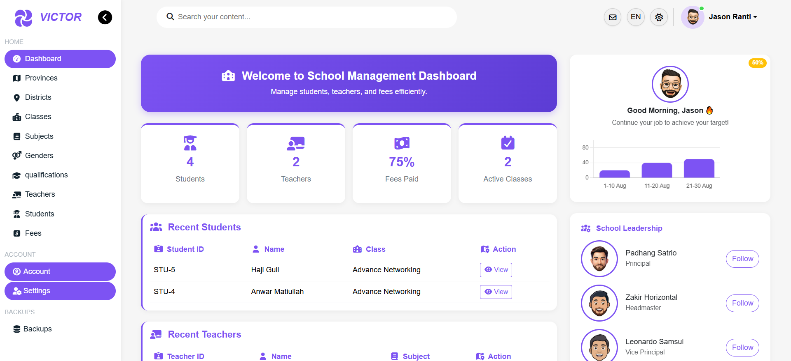

#  **Student Management Dashboard**

A complete and fully modular **Student Management Dashboard** built with **PHP, MySQL, Bootstrap 5, JavaScript, and AJAX**, designed for managing school data with modern UI, advanced reporting tools, automated backups, and multi-language support.

---

##  **Features**

###  **1. Secure Admin Login**

- Password encrypted in database
- PHP sessions
- Auto-redirect protection
- Logout confirmation with SweetAlert2

###  **2. Modern Dashboard**

Includes:

- Total students
- Total teachers
- Total classes
- Fees collected
- Latest registration
- Latest payment
- Active students
- Student gender chart
- Fee collection chart
- Real-time statistics using **Chart.js**

###  **3. Fully Modular Architecture**

Each module has:

- UI file (PHP)
- API file (PHP backend)
- JS controller (AJAX logic)
- Validation
- Export (PDF/CSV)
- Client-side search

Modules included:

- Students
- Teachers
- Classes
- Subjects
- Fees
- Districts
- Provinces
  -Qualifications
- Genders

###  **4. Backup & Restore System**

- Create SQL backup (auto timestamped)
- Download backup file
- Restore backup from uploaded SQL
- Backup folder auto-organized

###  **5. Light / Dark Theme**

- Theme preference saved in localStorage
- Smooth UI switch

###  **6. Multi-Language Support**

Languages included:

- English
- Pashto

Dynamic translation using JSON + JavaScript.

###  **7. Export Tools**

- PDF export using **jsPDF + html2canvas**
- CSV export for every table

###  **8. Client-side Search**

Instant search for all modules with clean highlighting.

---

## 🏗**Technology Stack**

| Layer          | Technology                     |
| -------------- | ------------------------------ |
| Frontend       | HTML5, CSS3, Bootstrap 5       |
| Scripting      | JavaScript (Vanilla + AJAX)    |
| Backend        | PHP (Modular API architecture) |
| Database       | MySQL                          |
| Charts         | Chart.js                       |
| Alerts         | SweetAlert2                    |
| Exports        | jsPDF, html2canvas, CSV        |
| Icons          | FontAwesome                    |
| Multi-language | JSON-based system              |

---

##  **Project Directory Structure**

```
dashboard/
 ├── Admin/
 ├── api/
 ├── assets/
 ├── backups/
 ├── common/
 ├── config/
 ├── css/
 ├── js/
 ├── languages/
 ├── schema/
 ├── util/
 ├── validation/
 ├── webfonts/
 ├── index.php
 └── ...
```

Each directory contains dedicated and modular components for scalability and easy maintenance.

---

## 🗄 **Database Setup**

1. Import the schema located at:

   ```
   schema/school.sql
   ```

2. Update database credentials in:

   ```
   config/db.php
   ```
3. Default username and password
   
   ```
   username : admin@gmail.com
   password : admin123
   ```

After that, login with your created admin credentials.

---

##  **Installation & Deployment**

### **1. Requirements**

- PHP 7+
- MySQL 5.7+
- Apache / Nginx
- mod_rewrite enabled
- Write permissions for `/backups/`

### **2. Installation Steps**

```
git clone https://github.com/imranmalakzai/student-management-system
cd student-management-system
```

- Import database
- Configure `/config/db.php`
- Deploy on local or live server (XAMPP / WAMP / cPanel / VPS)

---

##  **Dashboard Preview**

(You can add screenshots here)

```

```

---

## 🔌 **API Structure Example**

### **Get Students**

```
GET api/student.php?action=getAll
```

### **Create Teacher**

```
POST api/teacher.php?action=create
```

### **Delete Class**

```
POST api/class.php?action=delete&id=5
```

Every module follows consistent API patterns.

---

## 📦 **Export Features**

### **CSV Export**

- Converts table rows to downloadable CSV
- Works offline
- Lightweight and fast

### **PDF Export**

Powered by:

- `jsPDF`
- `html2canvas`

One-click PDF download for reports.

---

## 🔁 **Backup System**

Backups stored automatically in:

```
backups/
```

Each file contains:

```
backup_YYYY-MM-DD_hh-mm-ss.sql
```

You can also restore backups inside the app.

---

## 🌐 **Languages**

```
languages/
 ├── english.json
 └── pashto.json
```

Language switching handled by:

```
js/language.js
```

---

## ✨ **Future Improvements**

- Attendance module
- Student portal
- Role-based user system
- Exam & results module
- Email/SMS notifications
- Complete REST API version

---

## 👤 **Author**

**Developer:** _Imran Malakzai_
**Country:** Afghanistan
**Profession:** MERN Stack Developer & IT Specialist
**Languages:** Pashto, English
**Skills:** React, Node.js, PHP, MySQL, TailwindCSS, Docker, Git

---

## 📝 **License**

This project can include any license you prefer (MIT recommended).

---


